# SQL E-Commerce Data Analysis

This project analyzes an e-commerce dataset using MySQL. The project starts with database setup and data inspection, followed by data quality assessment, data standardization, validation, exploratory data analysis, business analysis, KPI reporting, and advanced SQL.

The main objective is to transform raw e-commerce data into useful business insights and build reusable SQL reporting objects.

## Tools Used

- MySQL
- MySQL Workbench 8.0 CE
- SQL

## Dataset

The project uses three related tables:

| Table       | Description                                                                                        |
|-------------|----------------------------------------------------------------------------------------------------|
| `customers` | Customer details such as name, gender, age, city, state, signup date, and membership.              |
| `products`  | Product details such as product name, category, brand, price, stock quantity, supplier, and rating.|
| `orders`    | Order transactions including order date, quantity, discount, payment method, and order status.     |

### Database Relationships

```text
Customers
    │
    │ Customer_ID
    ▼
Orders
    ▲
    │ Product_ID
    │
Products
```

- One customer can place multiple orders.
- One product can appear in multiple orders.
- The `orders` table connects the `customers` and `products` tables.

## Project Workflow

```text
Database Setup
      ↓
Data Quality Assessment
      ↓
Data Standardization
      ↓
Data Type Conversion
      ↓
Data Validation
      ↓
Exploratory Data Analysis
      ↓
Business Analysis
      ↓
KPI Analysis
      ↓
Advanced SQL
      ↓
Views and Stored Procedures
```

## Project Steps

### 1. Database Setup

- Created the e-commerce database.
- Imported the customer, product, and order datasets.
- Verified the imported tables.
- Inspected table structures and data types.
- Checked row and column counts.

### 2. Data Quality Assessment

The following checks were performed:

- NULL and blank values
- Duplicate rows
- Duplicate customer, product, and order IDs
- Invalid values
- Inconsistent text values
- Referential integrity issues
- Potential outliers

### 3. Data Standardization

Data was standardized by:

- Removing leading and trailing spaces
- Converting blank values to NULL
- Standardizing text values
- Standardizing category names
- Standardizing membership values
- Standardizing payment methods
- Creating backup tables before making changes

### 4. Data Type Conversion

Relevant columns were converted to suitable data types to support accurate analysis and calculations.

### 5. Data Validation

The cleaned data was validated by checking:

- Missing values
- Duplicate IDs
- Invalid age values
- Invalid prices
- Invalid quantities
- Invalid ratings
- Invalid discounts
- Invalid foreign keys
- Future dates
- Accepted categorical values

### 6. Exploratory Data Analysis

EDA was performed to understand:

- Customer distribution
- Age distribution
- Membership distribution
- Product and category distribution
- Brand and supplier distribution
- Payment method usage
- Order status distribution
- Monthly and yearly order trends
- Product ordering patterns

### 7. Business Analysis

The analysis answered business questions related to:

- Total and net revenue
- Discount impact
- Average order value
- Revenue by category and brand
- Revenue by customer
- Revenue by membership
- Revenue by state and city
- Product performance
- Monthly and yearly revenue trends
- Top customers by purchases and revenue

### 8. KPI Analysis

The following KPIs were calculated:

**Sales KPIs**

- Total Gross Revenue
- Total Discount Amount
- Total Net Revenue
- Average Order Value
- Total Orders
- Total Quantity Sold

**Customer KPIs**

- Total Customers
- Repeat Customers
- Revenue per Customer

**Product KPIs**

- Products Sold
- Average Selling Price
- Average Quantity per Order

**Operational KPIs**

- Cancellation Rate
- Revenue by Membership
- Revenue by State
- Revenue by Payment Method
- Monthly Revenue
- Yearly Revenue

### 9. Advanced SQL

Advanced SQL concepts used in the project include:

- Common Table Expressions (CTEs)
- Window Functions
- `ROW_NUMBER()`
- `RANK()`
- `DENSE_RANK()`
- `LAG()`
- Running Totals
- Revenue Contribution Analysis
- Customer Lifetime Value (CLV)
- Top-N Analysis
- Category Ranking

### 10. Views and Stored Procedures

A reusable `sales_summary` view was created by combining customer, product, and order information. It also calculates:

- Gross Revenue
- Discount Amount
- Net Revenue

Additional reporting views were created for:

- Customer Revenue Summary
- Product Performance
- Monthly Sales Summary
- Category Performance
- State Revenue Summary

Stored procedures were created for:

- Top Customers
- Revenue by Year
- Category Performance

## SQL Concepts Covered

- `SELECT`
- `WHERE`
- `DISTINCT`
- `ORDER BY`
- `GROUP BY`
- `HAVING`
- Aggregate Functions
- `CASE`
- String Functions
- Date Functions
- Mathematical Functions
- `JOIN`
- Subqueries
- Common Table Expressions (CTEs)
- Window Functions
- Ranking Functions
- Views
- Stored Procedures

## Repository Structure

```text
SQL-Ecommerce-Data-Analysis
│
├── Dataset
│   ├── Customers_Dataset.csv
│   ├── Orders_Dataset.csv
│   ├── Products_Dataset.csv
│   └── Ecommerce_Dataset.xlsx
│
├── SQL Queries
│   ├── 01_Database_Setup.sql
│   ├── 02_Data_Quality_Assessment.sql
│   ├── 03_Data_Standardization.sql
│   ├── 04_Data_Type_Conversion.sql
│   ├── 05_Data_Validation.sql
│   ├── 06_EDA_(Exploratory Data Analysis).sql
│   ├── 07_Business_Analysis.sql
│   ├── 08_Sales_Summary_View.sql
│   ├── 09_KPI_Analysis.sql
│   ├── 10_Advanced_SQL.sql
│   └── 11_Business_Reporting_Objects.sql
│
├── Documentation
│   └── E-Commerce Data Analysis using SQL.pdf
│
├── Screenshots
│   ├── 01_Database_Overview.png
│   ├── 02_Customers_Table_Data.png
│   ├── 03_Products_Table_Data.png
│   ├── 04_Orders_Table_Data.png
│   ├── 05_Duplicate_Customer_Check.png
│   ├── 06_Remove_Leading_Trailing_Spaces.png
│   ├── 07_Data_Validation.png
│   ├── 08_Least_Ordered_Product.png
│   ├── 09_Customers_Age_Distribution.png
│   ├── 10_Top10_Customers_With_Highest_Purchase.png
│   ├── 11_Top10_Customers_By_Revenue.png
│   └── 12_Monthly_KPI_Analysis.png
│
├── README.md
└── LICENSE
```

## Screenshots

### Database Overview

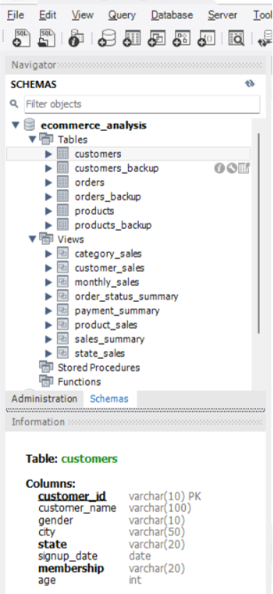

### Customers Table

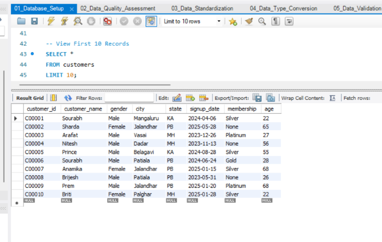

### Products Table

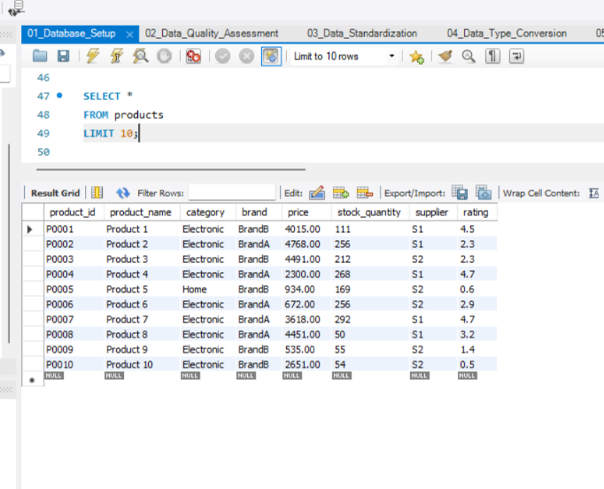

### Orders Table

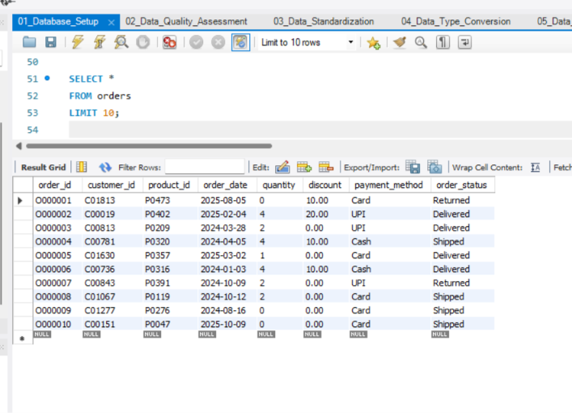

### Data Quality Assessment

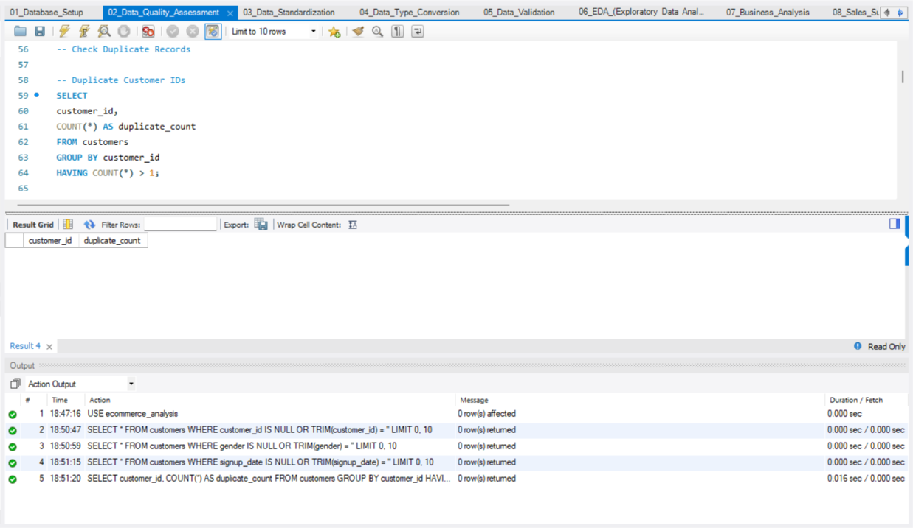

### Data Standardization

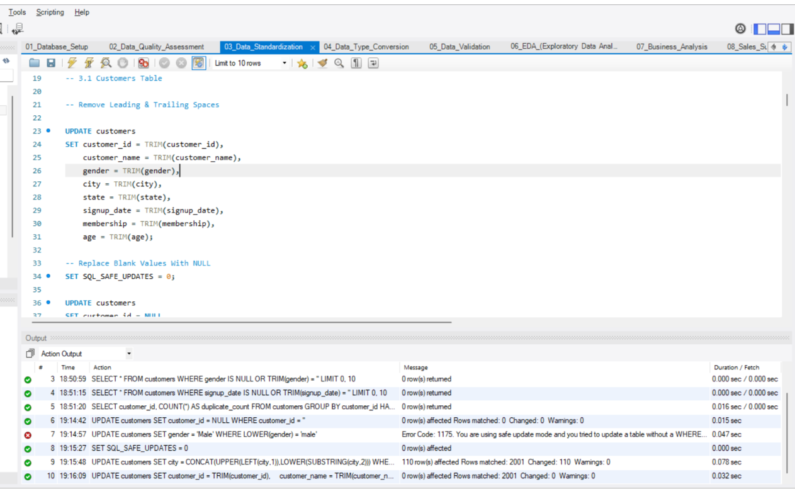

### Data Validation

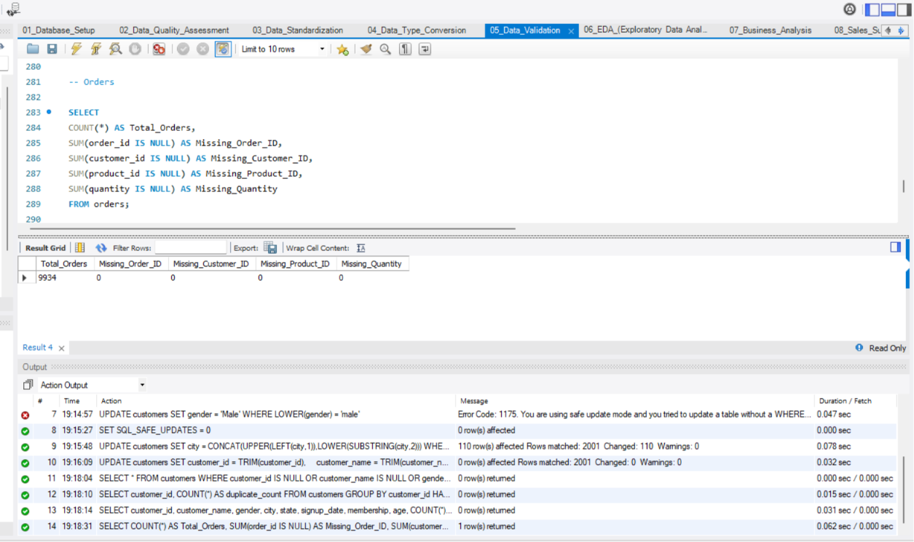

### Exploratory Data Analysis

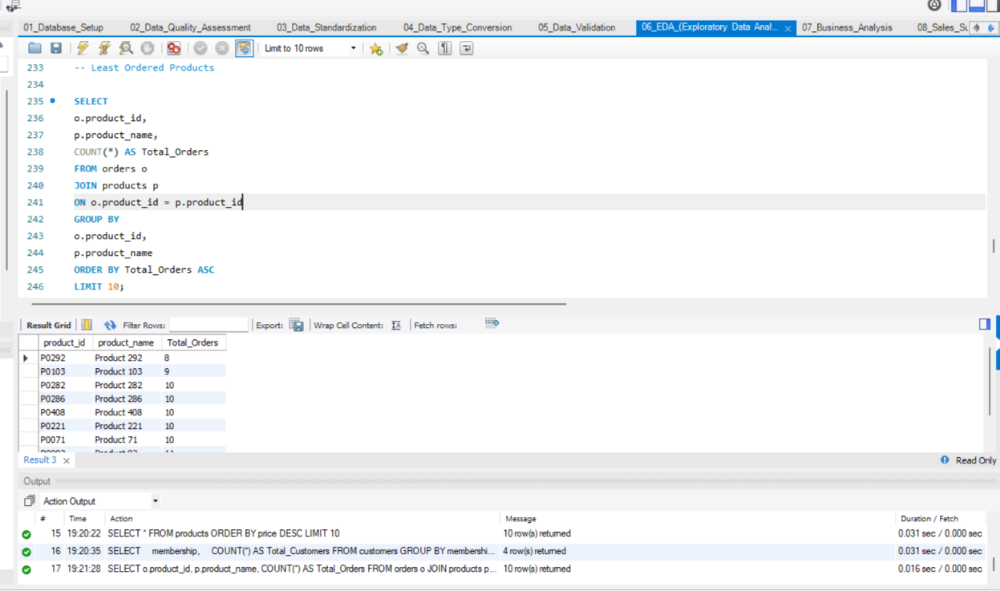

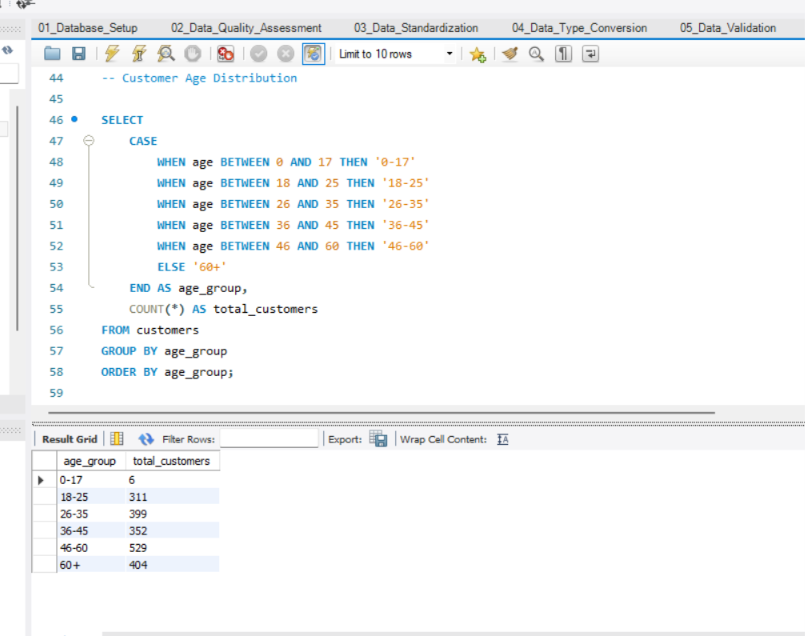

### Customer Analysis


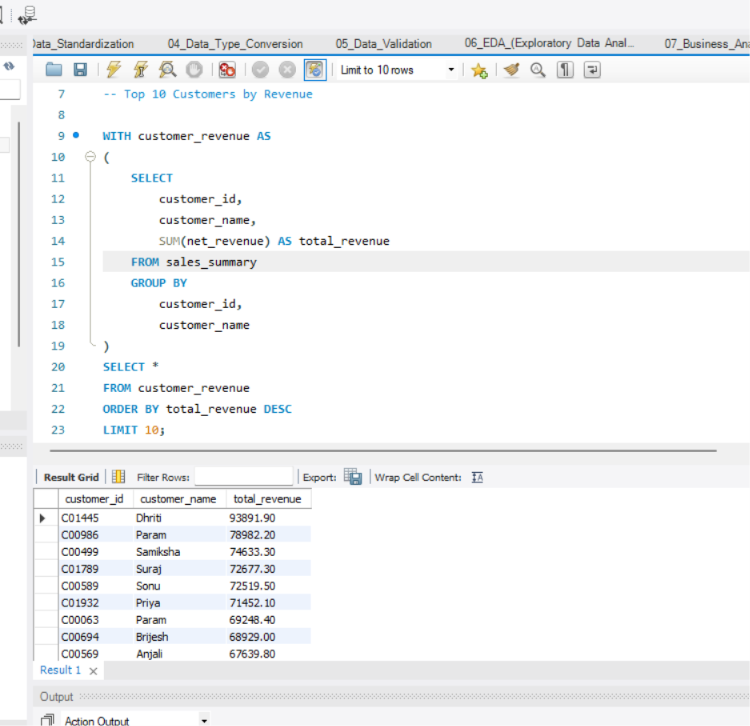

### Monthly KPI Analysis

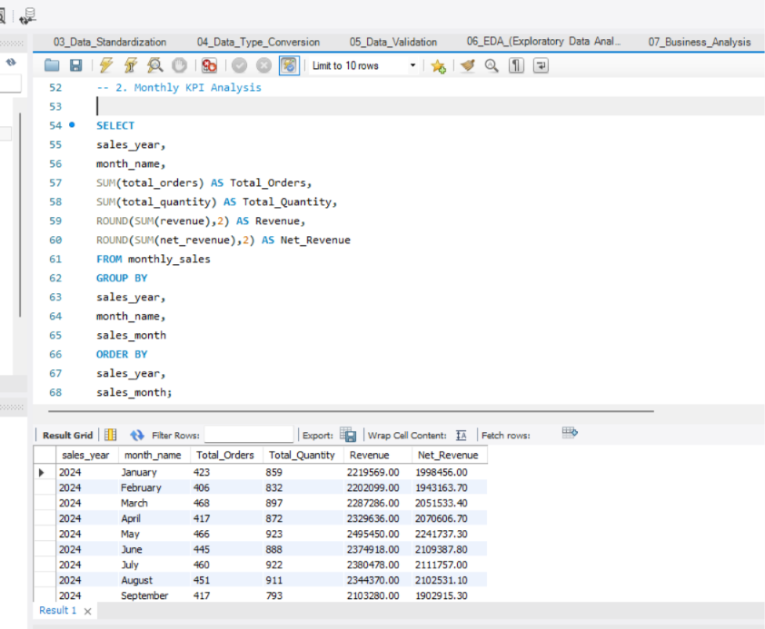

## How to Run the Project

1. Download or clone this repository.
2. Open MySQL Workbench 8.0 CE.
3. Import the datasets from the `Dataset` folder.
4. Execute the SQL files in numerical order.
5. Review the query results and reporting objects.

## Skills Demonstrated

- SQL Data Cleaning
- Data Quality Assessment
- Data Standardization
- Data Validation
- Exploratory Data Analysis
- Business Analysis
- KPI Reporting
- Relational Database Design
- CTEs and Window Functions
- Views and Stored Procedures
- Analytical Problem Solving

## Future Improvements

- Add indexes to improve query performance.
- Implement triggers for automated data validation.
- Add primary and foreign key constraints after completing data quality checks.
- Connect the SQL database to Power BI or Tableau.
- Automate recurring reports using scheduled procedures.
- Extend the analysis with RFM segmentation, cohort analysis, and sales forecasting.

## License

This project is licensed under the MIT License.

## Author

**Vishal Patil**

Data Analyst | SQL | Excel | Python | Power BI

[LinkedIn Profile](https://www.linkedin.com/in/vishal-patil-338279414/)
